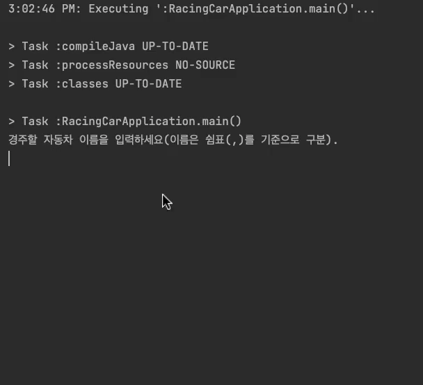

    

# 자동차 경주 - TDD

---

> 우아한테크코스 웹 백엔드 4기, 자동차 경주 - TDD 저장소입니다.

## 기능 구현 목록

---

- [x] 자동차 이름 입력 받기
    - [x] `경주할 자동차 이름을 입력하세요(이름은 쉼표(,)를 기준으로 구분).`
    - [x] 유효성 검증
        - [x] 쉼표로 구분, 5자 이하만 가능하다
        - [ ] 예외 발생 시, 다시 입력 받는다

- [x] 시도 횟수 입력 받기
    - [x] `시도할 회수는 몇회인가요?`
    - [x] 유효성 검증
        - [x] 시도 횟수는 1 이상의 정수로 입력해야 한다
        - [ ] 예외 발생 시, 다시 입력 받는다

- [x] 자동차 전진 구현
    - [x] 0에서 9사이의 random 값이 4 이상일 경우 전진한다
    - [x] 시도 횟수 만큼 전진 시도 후 우승자를 판별한다
        - [x] 우승자는 복수일 수 있다

- [x] 실행 결과 출력
    - [x] `실행 결과`
    - [x] `{자동차 이름1} : (전진횟수만큼) - `
    - [x] `{자동차 이름1}, {자동차 이름3} 가 최종 우승했습니다.`

   
