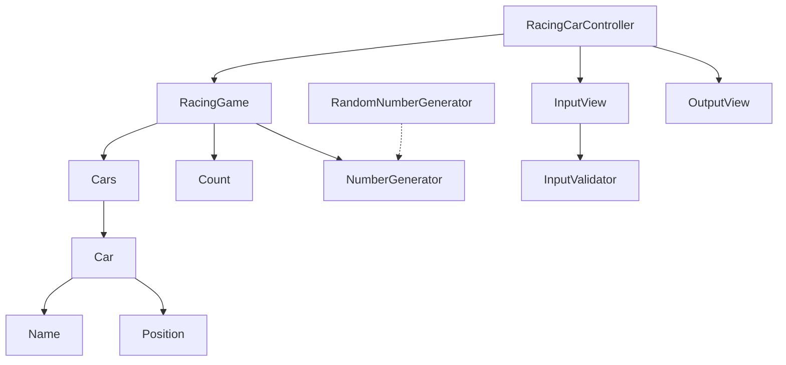

# java-racingcar

자동차 경주 미션 저장소

## 자동차 게임 다이어그램

## 개요

자동차 게임은 주어진 시도 횟수 동안 차량을 이동하여 진행한다.  
차량의 이름은 쉼표(,)로 구분된 값으로 입력 받으며, 사용자가 입력한 시도 횟수 만큼 게임이 진행된다.  
가장 멀리간 차량이 우승하며, 동일한 거리를 이동한 경우 공동 우승이 존재한다.

## 요구사항

### 자동차

- [x] 자동차는 이름을 가진다.
    - [x] 1자 이상, 5자 이하의 이름을 가진다.
    - [x] 허용된 크기의 이름이 아닌 경우 예외를 던진다.
- [x] 자동차는 위치를 가진다.
    - [x] 초기값은 0이다.
- [x] 자동차는 값을 입력받고 이동한다.

### 자동차 경주

- [x] 시도할 횟수를 가진다.
    - [x] 시도 횟수는 최대 100회까지 가능하다.
- [x] 시도 횟수만큼 게임을 진행한다.
    - [x] 진행은 각 차량마다 0~9 사이의 무작위 값을 구한 후 해당 값에 따라 전진 여부를 결정한다.
        - [x] 4 이상일 경우 전진한다.
        - [x] 3 이하의 값이면 멈춘다.
- [x] 게임을 완료한 후 가장 멀리 이동한 우승자들을 반환한다.
    - [x] 우승자는 한 명 이상일 수 있다.

### 입력

- [x] 쉼표(,)로 구분된 5자 이하의 차 이름 목록을 입력받는다.
    - [x] 중복되는 경우 예외를 던진다.
    - [x] 1자 이상, 5자 이하의 이름이 아닌 경우 예외를 던진다.
- [x] 1이상, 100회 이하의 게임 시도 횟수를 입력받는다.
    - [x] 0 또는 음수인 경우 예외를 던진다.
    - [x] 100을 초과하는 경우 예외를 던진다.

### 출력

- [x] 1회 시도 후 실행 결과를 출력한다.
- [x] 최종 우승자들을 출력한다.
