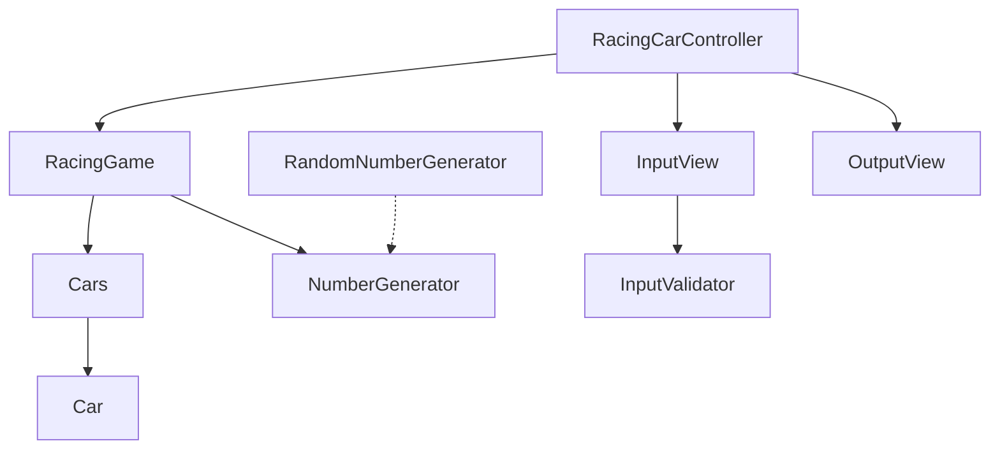

# java-racingcar

자동차 경주 미션 저장소

## 우아한테크코스 코드리뷰

- [온라인 코드 리뷰 과정](https://github.com/woowacourse/woowacourse-docs/blob/master/maincourse/README.md)

## 그래프

## 요구사항

Car

- [x] 자동차는 5자 이하의 이름을 가진다.
- [x] 자동차는 위치를 가진다.
- [x] 자동차는 값을 입력받고 이동한다.
    - 4 이상이면 전진한다.
    - 3 이하의 값이면 멈춘다.

Cars

- 경주를 진행하는 자동차들의 일급 컬렉션
- [x] 자동차들을 움직인다.

NumberGenerator, RandomNumberGenerator

- 숫자 생성 전략
- [x] 랜덤 생성 전략의 경우 0~9 사이의 값을 랜덤으로 생성한다.

RacingGame

- [x] 시도할 횟수를 가진다.
- [x] 게임을 진행한다.
- [x] 게임을 완료한 후 우승자를 반환한다.
    - 우승자는 1명 이상일 수 있다.

InputView

- [x] 경주할 자동차 이름을 입력한다.
    - 이름은 쉼표를 기준으로 구분한다.
- [x] 시도할 횟수를 입력한다.

InputValidator

- [x] 시도 횟수
    - 1 이상 입력하는지 검증한다.
- [x] 자동차 이름
    - 쉼표(,)로 구분된 이름을 입력하는지 검증한다.
    - 1대 이상의 자동차를 입력하는지 검증한다.

OutputView

- [x] 실행 결과를 출력한다.
- [x] 최종 우승자를 출력한다.
