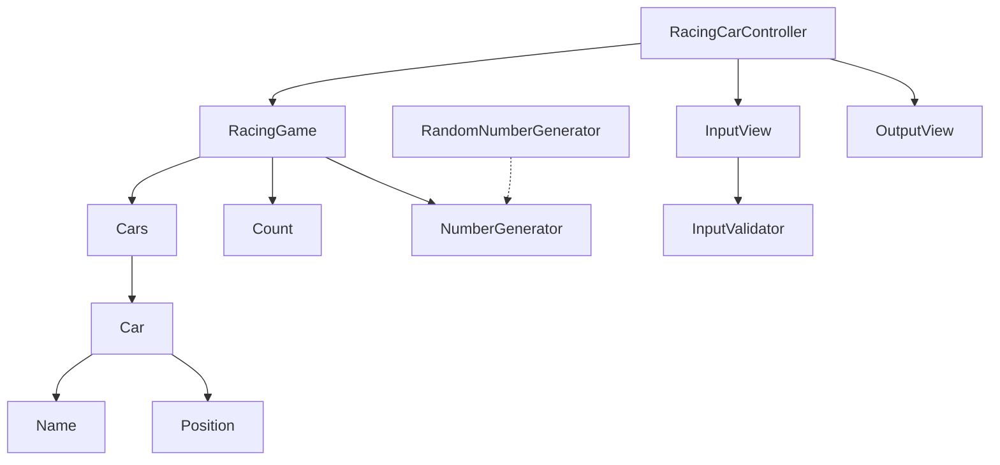

# java-racingcar

자동차 경주 미션 저장소

## 우아한테크코스 코드리뷰

- [온라인 코드 리뷰 과정](https://github.com/woowacourse/woowacourse-docs/blob/master/maincourse/README.md)

## 개요

해당 저장소는 자동차 경주 게임을 구현한 저장소입니다. 플레이어가 `n`대의 자동차 이름과 `m`번의 시도 횟수를 입력하면 게임이 시작됩니다. 조건에 의해 자동차는 **전진 또는 멈출 수** 있습니다. m번의 시도
후 자동차 경주 게임은 종료되고, **가장 멀리 전진한 자동차는 우승자**가 됩니다. 우승자는 한 명 이상일 수 있습니다.

## 세부사항

### 자동차

- 자동차는 이름을 가진다.
    - [x] 이름은 1자 이상, 5자 이하여야 한다.
    - [ ] 이름은 중복되지 않는다.
- 자동차는 위치를 가진다.
    - [x] 같은 위치에서 출발한다.
    - [x] 0 이상의 위치를 가진다.
- 자동차는 값에 따라 이동한다.
    - [x] 4 이상이면 전진한다.
    - [x] 3 이하의 값이면 멈춘다.

### 자동차 게임

- 시도할 횟수가 존재한다.
- 숫자 생성 전략이 존재한다.
    - [x] 랜덤 생성 전략의 경우 0~9 사이의 값을 랜덤으로 생성한다.
- 게임을 진행한다.
    - [x] 게임 진행 가능 여부를 확인한다.
    - [ ] 게임을 진행한 차 목록을 반환한다.
- 우승자를 반환한다.
    - [x] 우승자는 1명 이상일 수 있다.

### 입력

- 경주할 자동차 이름을 입력한다.
    - [x] 쉼표(,)로 구분된 이름을 입력하는지 검증한다.
    - [] 1대 이상, 100대 이하의 자동차를 입력하는지 검증한다.
- 시도할 횟수를 입력한다.
    - [ ] 1회 이상 100회 이하의 횟수만 시도할 수 있다.

### 출력

- [x] 실행 결과를 출력한다.
- [x] 최종 우승자를 출력한다.

## 도메인 다이어그램

