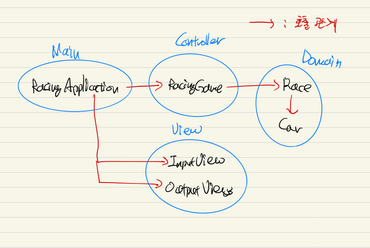

# stringcal-calculator
문자열 계산기 + 테스트 코드

# java-racingcar
자동차 경주 게임 미션 저장소

## 기능 구현 목록
- [x] 이름 입력
    - [x] 입력 예외 처리
        - [x] 콤마 연속입력
        - [x] 공백 이름
    - [x] 객체 내 예외 처리
        - [x] 중복된 이름
- [x] 자동차 생성 
    - [x] 레이스 객체에 자동차 배열 저장
- [x] 횟수 입력
    - [x] 레이스 객체에 횟수 저장
    - [x] 예외 처리
        - [x] 정수 입력 여부
    - [x] 객체내 예외 처리
        - [x] 자연수 여부
- [x] 레이싱 진행
    - [x] 난수 발생
    - [x] 자동차 전진 기능
    - [x] 횟수 만큼 반복
    - [x] 자동차 상태 출력
    - [x] 경기 진행 상황 출력
    - [x] 우승자 판별
- [x] 우승자 출력
- [x] 리팩토링

## 테스트 구현 목록
- [x] 이름 입력
    - [x] 입력 예외 처리
        - [x] 콤마 연속입력
        - [x] 공백 이름
    - [x] 객체 내 예외 처리
        - [x] 중복된 이름
- [x] 횟수 입력
    - [x] 객체내 예외 처리
        - [x] 자연수 여부
- [x] 레이싱 진행
    - [x] 난수 발생
    - [x] 우승자 찾기

## 리팩토링 목록
- [x] Car 내부 equals(), hashcode() 사용
- [x] 테스트 가능 코드 추가 및 분리
- [x] Class 내부 코드 순서 (public -> priavate 관련된 것 끼리 엮어서)
- [x] 값이 변하지 않는 지역 변수 인자는 final로 변경 확인
- [x] 자료구조나 자료형이 들어간 변수명 변경
- [x] 도메인에 sout을 뷰로 분리
- [x] 컬렉션 api 사용가능한 부분 대체 

## 1차 피드백 이후 리팩토링
- [x] 클래스 이름 변경
- [x] 불필요한 클래스 제거
    - [x] Race 클래스와 Referee 클래스를 Race 하나로 합친다.
- [x] 도메인 모델 (개인적으로 해보고 싶음)
- [x] 클래스 초기화를 생성자를 통해 수행
    - [x] controller/RacingGame.java
    - [x] domain/Race.java
- [x] 메소드가 한 가지 일만 하도록 분리
    - [x] domain/Race.java
- [x] 불필요한 테스트 코드를 제거
- [x] 인스턴스 변수에 접근하지 않는 메서드 static 선언
- [x] 도메인에 더 많은 테스트 추가
- [x] 서로 다른 케이스에 대해 테스트를 분리
- [x] controller/RacingGame 클래스 내에서 View 호출 제한
    - [x] Input validation을 InputView 로 빼낸다.
- [x] 도메인과 출력을 분리   
    - [x] toString() 을 사용하지 않는다는 것은, 인스턴스 내의 정보를 OutputView 에 전달할 수 있어야 한다는 것을 의미한다.
    따라서 Race, RaceResult, Car 에 getter 메서드를 추가한다.
    - [x] RacingGame 내에서 처리하던 출력 로직을 OutputView 로 빼낸다.
- [x] RaceResult 클래스 제거

## 2차 피드백 이후 리팩토링
- [x] MVC 패턴 리팩토링 (View 호출을 main 에서만 하고, 도메인과 컨트롤러에서는 전혀 호출하지 않도록 수정했습니다.)
- [x] List 순회할 때 Iterator 대신 for-each
- [x] 테스트 코드에서 불필요한 로컬 변수 제거, 중복 제거 
- [x] 불필요한 테스트 코드 제거
- [ ] 테스트 애노테이션 (@Test) 중복 제거 (어떻게 하는지 모르겠습니다. ㅠㅠ)
- [x] 테스트 코드에서 List 생성 코드 단순화
- [x] 테스트 코드의 우승자 판별 테스트에서 containsExactly() 활용

## 도메인 모델
