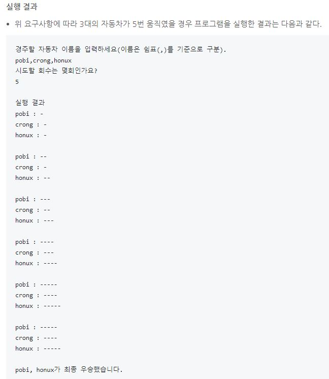

# java-racingcar
자동차 경주 게임 미션 저장소

## 우아한테크코스 코드리뷰
* [온라인 코드 리뷰 과정](https://github.com/woowacourse/woowacourse-docs/blob/master/maincourse/README.md)

## 기능 요구사항
- 주어진 횟수 동안 n대의 자동차는 전진 또는 멈출 수 있다.
- 각 자동차에 이름을 부여할 수 있다. 전진하는 자동차를 출력할 때 자동차 이름을 같이 출력한다.
- 자동차 이름은 쉼표(,)를 기준으로 구분하며 이름은 5자 이하만 가능하다.
- 사용자는 몇 번의 이동을 할 것인지를 입력할 수 있어야 한다.
- 전진하는 조건은 0에서 9 사이에서 random 값을 구한 후 random 값이 4 이상일 경우 전진하고, 3 이하의 값이면 멈춘다.
- 자동차 경주 게임을 완료한 후 누가 우승했는지를 알려준다. 우승자는 한 명 이상일 수 있다.

## 실행 결과

## 구현할 기능
1. 이름 입력
    1. 쉼표(,) 기준으로 이름 분리
    2. 예외 처리
        1. 이름에 빈 값이 들어올 경우
        2. 쉼표가 연속으로 있을 경우(ex : a,,b)
        3. 양 끝의 공백 삭제, 이름사이의 공백은 허용
        4. 참가자가 1명인 경우
        5. 이름이 중복될 경우
    
2. 시도 횟수 입력
    1. 예외 처리
        1. 숫자 외 문자가 들어올 경우, 정수가 아닐 경우
        2. 숫자가 0 이하일 경우
        3. 숫자와 공백이 있을경우 공백삭제
            
3. 게임 준비
    1. 자동차 객체 생성
    
4. 게임 실행
    1. 랜덤한 값 구하기
    2. 전진 or 정지하기
    3. 모든 자동차 객체에 대해 1 ~ 2 적용
    4. 시도 횟수 만큼 반복
    
5. 우승자
    1. 최대 주행 거리 구하기
    2. 최대 주행 거리에 해당하는 자동차 탐색
    3. 우승자 출력
