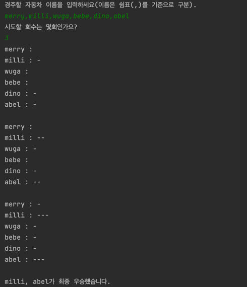

# java-racingcar

자동차 경주 미션 저장소

## 우아한테크코스 코드리뷰

- [온라인 코드 리뷰 과정](https://github.com/woowacourse/woowacourse-docs/blob/master/maincourse/README.md)

---
## 자동차 경주 프로그램

- 여러 대의 자동차가 랜덤으로 움직이는 자동차 경주 게임입니다.

## 실행 순서
1. 게임에 참여할 자동차 이름을 입력합니다. (단, 한 글자 이상 다섯 글자 이하)
2. 게임을 실행할 횟수를 입력합니다. (단, 2회 이상 10회 이하)
3. 입력한 횟수 만큼 게임이 반복되어 자동차를 이동시킨 후 위치가 출력됩니다.
4. 가장 많이 이동한 자동차가 우승자가 되며, 최종 우승자가 출력됩니다.

## 실행 결과

