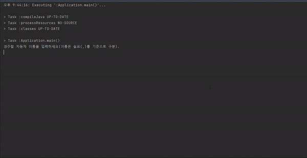

<p align="center">
    
</p>

# 미션 - 자동차 경주

###### `우아한테크코스 자동차 경주 미션을 진행한 저장소 입니다.`



## 🔍 프로그램 소개
#### 사용자의 입력으로부터 자동차 생성 및 이동을 시도하여, 우승자를 알려주는 프로그램입니다.


## 🚀 사용자 유의 사항
`사용자로부터 자동차의 이름과 시도(이동) 횟수를 입력받습니다.`
```
- 자동차 이름은 5글자 이하이다.
- 중복된 이름은 허용하지 않는다.
- 이름은 콤마(,)로 구분한다.
- 시도 횟수는 1회 이상을 입력한다.
```

