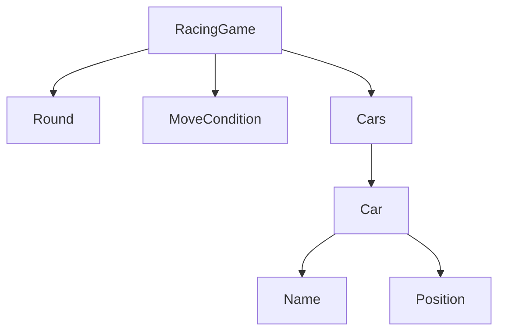

## 도메인 용어 정리

- 이름 Name
- 자동차 Car
- 이동조건 MoveCondition
- 라운드 Round
- 위치 Position
- 자동차경주게임 RacingGame

## 도메인 개념 관계 설명

아래는 `mermaid`라는 다이어그램을 만드는 언어를 이용해 도메인에 등장하는 개념들의 관계를 표현합니다.
인텔리제이의 `mermaid` 플러그인을 설치하면, 도형을 확인할 수 있습니다.

- `-->` 는 의존하는 방향을 의미합니다.
- ex) `Car --> Name`는 자동차(Car)는 이름(Name)을 가지거나, 알고 있어야 한다는 것을 의미합니다.

## 기능 목록

- [x] 자동차 경주 게임을 생성할 수 있다.
    - 경주에 참여하는 자동차의 수는 최소 2대이다.
    - 중복 이름을 가진 자동차는 허용하지 않는다.
- [x] 모든 자동차를 움직일 수 있다.
- [x] 이름을 생성할 수 있다.
    - 이름은 공백을 제외한 1자 이상 5자 이하만 가능하다.
- [x] 입력받은 이름으로 자동차를 생성한다.
- [x] 자동차는 전진할 수 있다.
    - 각 자동차마다 전진 조건이 있다.
    - 전진 조건은 0에서 9사이 랜덤 값 중 4 이상인 경우에만 전진한다.
- [x] 자동차의 위치는 증가될 수 있다.
- [x] 자동차는 위치를 가진다.
    - 위치는 0부터 시작한다.
- [x] 라운드 수를 입력 받는다.
    - 1 이상, 10이하의 숫자이다.
- [x] 라운드 수 만큼 경주를 진행할 수 있다.
- [x] 라운드 결과를 출력한다.
- [x] 이름을 입력 받는다.
    - 쉼표를 기준으로 구분한다.
- [x] 우승자를 출력한다.
    - 공동 우승이 가능하다.
    - 공동 우승일 경우에는 입력 받은 자동차 이름 순서대로 출력한다.

