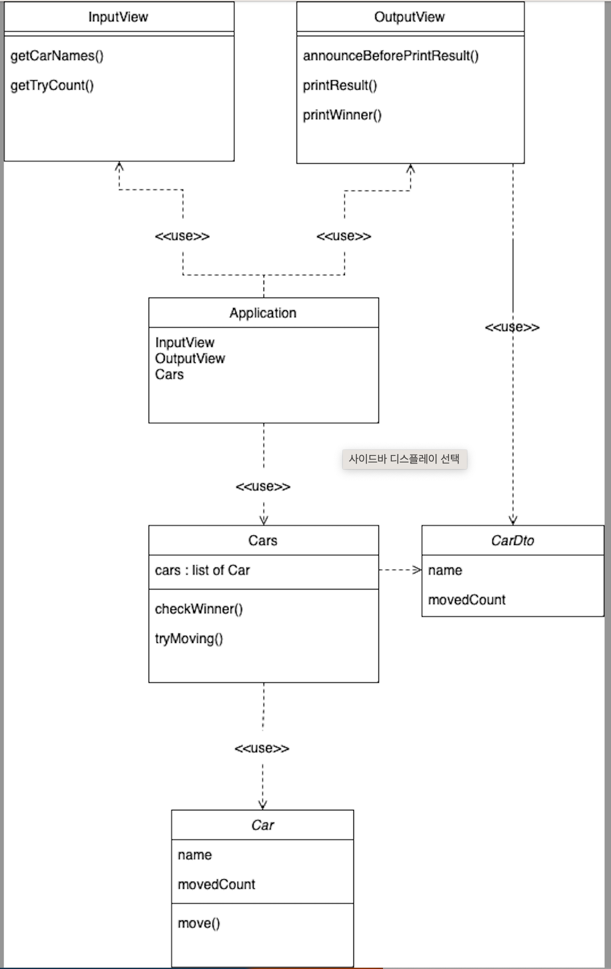

# 요구사항

## 학습 테스트 요구사항
* 조건1: JUnit의 @DisplayName 을 활용해 테스트 메소드의 의도를 드러내야 한다.

#### String 클래스에 대한 학습 테스트
* split 메소드
  - [x] 숫자 두 개를 `,` 으로 잘 구분하는지 확인하는 테스트 구현
  - [x] 숫자 한 개만 입력했을 때 입력한 숫자가 잘 반환되는지 확인하는 테스트 구현

* replaceAll 메소드
  - [x] 숫자 두 개를 `()` 안에 입력했을 때 `()` 를 제거하고 두 개의 숫자를 잘 반환하는지 확인하는 테스트 구현

* charAt 메소드
  - [x] 어떤 문자열이 주어졌을 때, 특정 위치의 문자를 잘 가져오는지 확인하는 테스트 구현
  - [x] 특정 위치의 문자열을 가져올 때, 위치 값을 벗어나면 `StringIndexOutOfBoundException` 이 발생하는지 확인하는 테스트 구현

#### Set Collection에 대한 학습테스트
* Set 데이터는 다음과 같이 주어진다.
  ```public class SetTest {
  private Set<Integer> numbers;

  @BeforeEach
  void setUp() {
  numbers = new HashSet<>();
  numbers.add(1);
  numbers.add(1);
  numbers.add(2);
  numbers.add(3);
  }

  }```

* size 메소드
  - [x] Set의 크기를 잘 반환하는지 확인하는 테스트 구현

* contains 메소드
    - [x] 입력한 값이 존재하는지 여부를 확인하는 테스트 구현
        - [x] JUnit ParameterizedTest 사용하여 반복되는 메서드 사용 제거
        - [x] JUnit CsvSource 사용하여 입력/출력 쌍을 활용한 테스트 구현

    
---

## 자동차 경주 요구사항

#### 클래스 다이어그램


#### 입력
- [x] 사용자로부터 자동차의 이름들을 입력 받기
- [x] 사용자로부터 이동 시도 횟수 입력 받기

#### 출력 
- [ ] 실행 결과를 출력하기 전 안내 메시지 출력
- [ ] 한 번의 이동이 일어날 때 마다 이동한 결과를 출력
- [ ] 최종 결과 출력

#### 도메인
- Car
  - [ ] 이동 시도
  - [ ] 유효성 검사
    - [ ] 이름

- Cars
  - [ ] 각 자동차들에 움직임을 시도하도록 명령
    - [ ] 현재 이동한 결과 전달을 위한 Dto 구현
  - [ ] 움직임이 끝난 후 우승자를 판별
  - [ ] 유효성 검사
    - [ ] 이동 시도 횟수