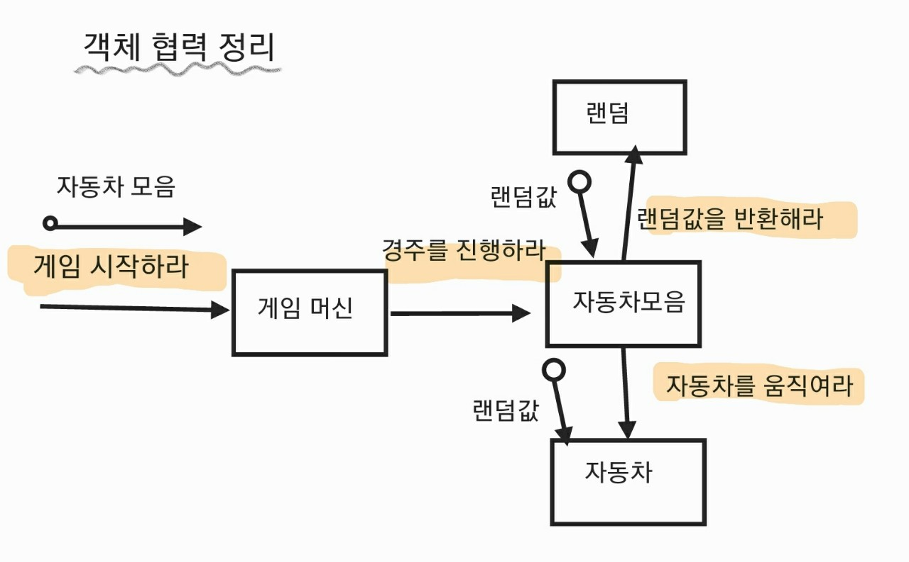

## 객체 협력 정리

## 객체 메시지 정리

- 게임 시작하라
- 경주를 진행하라
- 랜덤값을 반환해라
- 자동차 움직여라
- 입력하라
- 메뉴를 출력하라
- 자동차 위치를 반환하라
- 자동차 위치를 출력하라
- 자동차 모음을 생성하라
- 우승자를 출력하라

## 구현할 기능 목록 정리

- [x] 객체 모델링
- [x] 쉼표를 기준으로 구분된 n(최소 2 이상)대의 보장된 자동차 이름을 입력받는다.
    - [x] 보장된 자동차 이름(빈 문자열이 아닌 5자 이하의 영어로만 구성).
    - [x] 쉼표가 아닌 다른 구분자가 들어오면 에러가 발생한다.
- [x] 최소 1회 이상의 이동 횟수를 입력받는다.
    - [x] 음수, 실수, 문자열 등 유효하지 않은 값을 입력받으면 에러가 발생한다.
- [x] 게임이 한번 실행될때 tryCount가 줄어든다.
- [x] 각 자동차들은 이동 횟수만큼 전진할 수 있는 기회를 부여받는다.
    - [x] 랜덥값을 생성한다
    - [x] 전진 조건은 0에서 9 사이의 random 값을 구한 후 random 값이 4 이상인 경우이다.
    - [x] 각 회차별 실행 결과를 출력한다.
- [x] 게임이 끝나면 우승자가 나온다.
- [x] 가장 멀리 이동한 1명 이상의 우승자 명단을 탐색해 출력한다.

## 리펙토링 목록 정리

- [x] Screen 추상클래스 인터페이스로 변경
- [x] Dto를 어떻게 반환할 것인지, dto의 패키지 또한 변경한다. (Cars, Winners 객체)
- [x] 테스트를 위한 메소드를 삭제한다.
- [x] Collections.singletonList()를 사용한다.
- [x] 테스트 클래스에서 @DisplayName으로 테스트의 용도를 설명한다
- [x] 에러메세지 출력시 사용자가 어떤 값을 입력햇는지 또한 출력한다.
- [x] `할당 -> 검증`의 과정을 `복사(방어) -> 검증 -> 할당`의 과정으로 변환
- [x] 매개변수르 들어오는 값들을 final 처리
- [x] 원시값을 객체로 포장한다.
- [x] 중복 이름에 대해서 검증한다